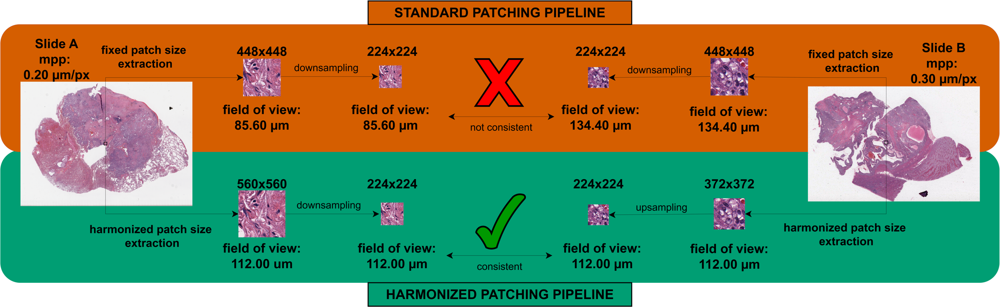
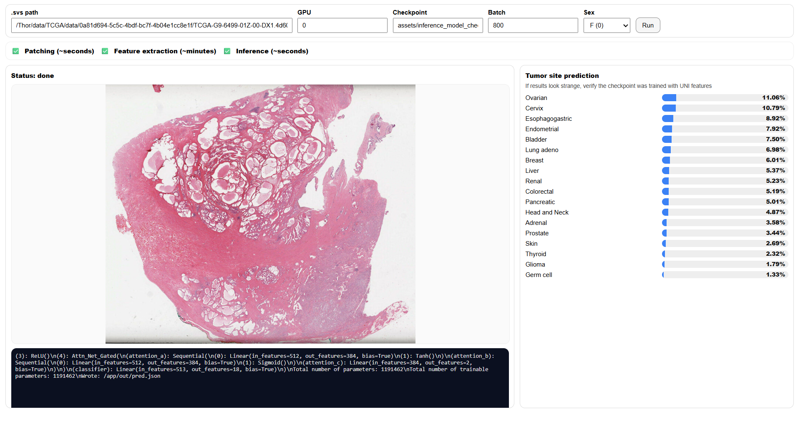

# CLAM Harmonized Preprocessing + TOAD Training/Evaluation

A reproducible pipeline for **harmonized whole-slide preprocessing** (patching + feature extraction) derived from **CLAM** (https://github.com/97andrea97/CLAM_harmonized), designed to standardize patch resolution across heterogeneous WSI slides using **MPP-based harmonization**.

The extracted features can then be used for **TOAD** (https://github.com/mahmoodlab/TOAD) training and evaluation, of which we included the edited scripts in this repo.

This repository provides:
- **Containerized preprocessing** with **MPP-based harmonization** (WSI → patches → features)
- **Containerized training/evaluation** for TOAD using the generated harmonized features
- (Optional) a **local inference GUI** for running a TCGA-trained model on a slide and exporting JSON summaries

## Purpose

Whole-slide images (WSI) often come from different scanners, sites, and formats (e.g., **SVS**, **TIFF/BTF**), with varying pixel sizes (**MPP, µm/px**). Without harmonization, models may see patches at inconsistent physical scales even when patch pixel sizes match:



This repository focuses on **harmonizing patch extraction by physical resolution**:
- patches are extracted using a **target MPP** (µm/px) when metadata is available
- a consistent physical field-of-view is enforced across slides
- optional QA artifacts can be generated to visually and quantitatively inspect the performed harmonization

TOAD (https://github.com/mahmoodlab/TOAD) training and evaluation scripts are included to benchmark performance using the **harmonized CLAM features**, but the central contribution of this repo is the **harmonized CLAM preprocessing**. The TOAD scripts have been modified to only perform the tumor site classification (removing the task of discriminating metastasis vs primary tumor).


---

## Model and feature availability

### Trained model weights
- ✅ **Publicly released weights (via Zenodo):** **ResNet-based TOAD trained model weights** (AGPL-3.0).
- ❌ **Not released:** **UNI-based TOAD trained model weights**, because the encoder terms restrict redistribution. UNI can be obtained following upstream instructions (see CLAM docs for encoder usage).

### Feature extraction encoders
- Default encoder: `resnet50_trunc`
- Optional encoder: `uni_v1` (requires separate setup; see upstream instructions)

---

## Data: downloading TCGA slides (GDC)

Slides must be obtained from the **GDC portal** / **GDC Data Transfer Tool** using the **GDC file IDs** listed in:

- `src_preprocessing/dataset_csv/TCGA.csv`

After download, point preprocessing to the folder containing the slides (either a flat folder or a directory tree containing them).

---

## Artifacts (Zenodo)

Download the containers and pretrained weights from Zenodo:
- Zenodo record: https://zenodo.org/records/18693711

After downloading, place the files here:
- `assets/containers/singularity_preprocessing.simg`
- `assets/containers/singularity_train_eval.simg`
- `assets/inference_model_checkpoint/TOAD_ResNet_harmonized.pt`

Verify integrity:
```bash
sha256sum -c SHA256SUMS
```

---

## Quickstart

### 0) Choose a container runtime (Singularity vs Apptainer)

Some systems provide `singularity`, others provide `apptainer`. Scripts support a `RUNTIME` variable:
- If `RUNTIME` is not set, the script auto-detects `apptainer` first, then `singularity`.
- You can override it explicitly:
  ```bash
  RUNTIME=apptainer bash run_preprocessing.sh ...
  # or
  RUNTIME=singularity bash run_preprocessing.sh ...
  ```

### 1) Harmonized preprocessing (WSI → FEATURES)

This script searches for slides under `--input-dir` (up to `--maxdepth`) and creates:
- `<out-root>/logs_and_metadata/` (per-slide logs + extracted metadata)
- `<out-root>/FEATURES/` (feature files)

**Default encoder:** `resnet50_trunc`

```bash
RUNTIME=singularity bash run_preprocessing.sh \
  --input-dir /abs/path/to/wsi_folder_or_tree \
  --out-root  /abs/path/to/preprocessing_output \
  --gpu 0
```

Useful options:
- `--encoder` `uni_v1` or `resnet50_trunc`
- `--jobs` parallel slides on the same GPU
- `--batch-size` feature extraction batch size (default 800)
- `--target-patch-size` CNN input tile size (default 224)
- `--maxdepth` search depth (default 2)
- `--image` preprocessing container path (default `assets/containers/singularity_preprocessing.simg`)
- `--code` preprocessing code path (default `src_preprocessing/`)

#### Harmonization parameters (core of this repo)

Preprocessing uses **MPP-based scaling** to harmonize patches to a consistent physical resolution (target µm/px). Depending on the script configuration, key parameters include:
- `target_mpp` (e.g., `0.25` µm/px)
- reference patch size for extraction (e.g., 448 px) + resize to CNN tile size (e.g., 224 px)
- step size (stride) in pixels

If a slide lacks usable MPP metadata, harmonization may be **skipped** and the slide **flagged** (behavior depends on the preprocessing configuration).

---

### 2) Training & evaluation (FEATURES → results)

Runs TOAD training and evaluation using the **harmonized feature bundle** produced by preprocessing.

Results are written under:
- `train_eval_output/RESULTS_EXP_*/`

```bash
RUNTIME=singularity bash run_train_eval.sh \
  --features /abs/path/to/preprocessing_output/FEATURES \
  --gpu 0
```

#### Forced test set (supported by default)

This repo supports an optional **forced test set** (a fixed list of slide IDs whose patients are always assigned to TEST across folds). By default the pipeline expects:

- `./src_train_eval/dataset_csv/forced_test_slides.csv`

If the file exists, the split creation step will include it automatically (via `--force_test_slides_csv`).

---

### 3) Inference GUI (optional, local)



Launch the GUI (default port 8765):
```bash
bash run_inference_GUI.sh
```

Change port:
```bash
PORT=9000 bash run_inference_GUI.sh
```

Outputs are written under:
- `output/inference_GUI_runs/<timestamp>/...`

To locate where the GUI expects the trained model weights path:
```bash
rg -n "weights|model|\.pt|checkpoint" src_inference_GUI/*.py
```

---

## Repository structure (high level)

- `run_preprocessing.sh` — containerized **harmonized** preprocessing (CLAM-derived)
- `run_train_eval.sh` — containerized train/eval using FEATURES (TOAD-derived)
- `run_inference_GUI.sh` — run local GUI (optional)
- `src_preprocessing/` — preprocessing subset (derived from CLAM; harmonization-focused)
- `src_train_eval/` — train/eval code (derived from TOAD + modifications, including forced test support)
- `src_inference_GUI/` — local GUI + inference logic
- `assets/containers/` — container build recipes (Dockerfiles)
- `LICENSE`, `NOTICE`, `THIRD_PARTY_NOTICES.md`, `licenses/` — licensing + attribution
- `CITATION.cff`, `DATA_AVAILABILITY.md`, `CHANGES.md` — paper-support files

---

## Licensing & attribution (summary)

- **Repository license:** GNU **AGPL-3.0** (see `LICENSE`).
- Derived components (summary):
  - **CLAM (GPL-3.0):** subset used for WSI patching and feature extraction, modified to support **MPP-based harmonization** and multi-backend slide I/O where applicable.
  - **TOAD (AGPL-3.0):** basis for training/evaluation and utilities (including forced-test split support where enabled).
- See `THIRD_PARTY_NOTICES.md` and `licenses/` for full details.

### Model weights license
- Public **ResNet-based** TOAD weights are released under **AGPL-3.0**.
- UNI-based trained weights are not distributed (see upstream UNI terms).

---

## Citation

See `CITATION.cff`. Please also cite the associated paper and the Zenodo record (DOI) once available.
